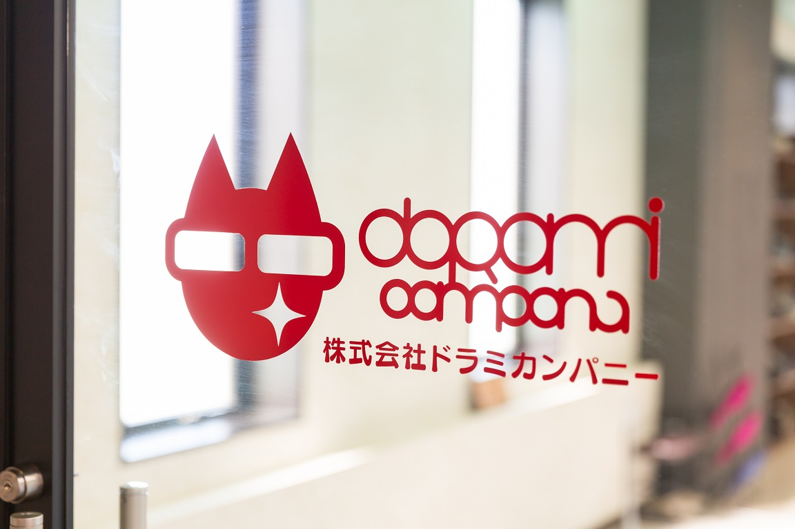

# Claude Code 実装依頼プロンプト
# 法人向けLP 素材追加実装

---

もみかるFC加盟募集の法人向けLPに、信頼性訴求のための素材を追加してください。

## 重要な前提

**既存LPは完成度が高く、シナリオもデザインも維持します。**
本指示書に明記された変更箇所「以外」には、絶対に手を加えないでください。

## 作業方法（既存ファイルは残す）

既存ファイルは絶対に上書きしないでください。すべて新規ファイルとして作成し、既存ファイルと並行して動作確認できる状態にします。

```
~/Desktop/momikaru-lp/
├── index.html              ← 既存（変更しない）
├── index_v2.html           ← 新規作成（修正版）
├── css/
│   ├── style.css           ← 既存（変更しない）
│   └── style_v2.css        ← 新規作成（修正版）
├── js/
│   ├── main.js             ← 既存（変更しない）
│   └── main_v2.js          ← 新規作成（修正版）
└── assets/                 ← 既存（変更しない、追加のみ）
```

新規ファイル（v2版）を作る際の手順：

1. 既存の `index.html` をコピーして `index_v2.html` を作成
2. 既存の `style.css` をコピーして `style_v2.css` を作成
3. 既存の `main.js` をコピーして `main_v2.js` を作成（必要な場合）
4. `index_v2.html` 内のCSS/JSパスを `_v2` 版に書き換え
5. 必要な変更を `_v2` 版にのみ加える
6. ローカルサーバーで `index_v2.html` を開いて動作確認
7. 既存の `index.html` も同じローカルサーバーで動作確認可能（並行運用）

これにより、修正版で問題が起きても既存LPには影響しません。本番デプロイ時に最終的に統合します。

## 素材ファイルの配置

以下のディレクトリ構造で、新しい素材ファイルを `assets/` 以下に追加してください。既存の `assets/` 内のファイルは削除しないでください。

```
~/Desktop/momikaru-lp/assets/
├── （既存ファイルはそのまま）
├── headquarters/
│   ├── hq_lobby.jpg              ← 新規追加
│   ├── hq_entrance_logo.jpg      ← 新規追加
│   └── hq_office.jpg             ← 新規追加
├── stores/
│   └── store_interior_main.jpg   ← 新規追加
├── doctors/
│   ├── dr_hanada_white.jpg       ← 新規追加
│   └── dr_morita_white.jpg       ← 新規追加
└── representative/
    └── representative_bw_white.png  ← 新規追加
```

素材ファイルは `~/Desktop/momikaru_assets/` に配置されているので、対応するパスにコピーしてください。

## 実装する変更内容（全9件）

### 変更1：03 Industry Issues セクションのコピー変更

**変更前**：
```
タイトル: リラクゼーションFC、成功者が少ない本当の理由。
サブコピー: （既存のサブコピー全文）

ISSUE 01: 従業員雇用型の限界。
　固定人件費の構造では、稼働率が落ちた瞬間に赤字化する。労務リスクが経営判断の足かせになる。

ISSUE 02: ロイヤリティ負担の重さ。
　売上の数%を毎月持っていかれる構造は、店舗数を増やすほど利益率が下がる悪循環を生む。

ISSUE 03: 店長人件費による利益圧迫。
　月給制の店長1名につき年間数百万円の固定費。2店舗目から採算が取れない最大の要因。

ISSUE 04: 属人性によるサービス品質のばらつき。
　人に依存する運営は、退職・異動の度に品質が揺れる。顧客満足度の再現性が担保できない。
```

**変更後**：
```
タイトル: 店舗型ビジネスの利益を奪う、4つの固定費。
サブコピー: 業態を問わず、店舗を持つ経営者が直面する構造的問題。

ISSUE 01: 従業員雇用型の限界。
　「固定人件費」という、最大の利益圧迫要因。

ISSUE 02: ロイヤリティ負担の重さ。
　売上に連動して増える「半固定費」が、拡大を阻む。

ISSUE 03: 店長人件費による利益圧迫。
　中間管理職コストが、2店舗目の採算ラインを上げる。

ISSUE 04: 属人性によるサービス品質のばらつき。
　「人」に依存する運営は、再現性とスケールを失う。
```

**変更しないこと**：
- 黒背景のセクションデザイン
- 黄色アクセントカラー
- 各ISSUEのタイトル文言
- セクション末尾の「これは、仕組みがない問題だ。」とその後のテキスト
- レイアウト・カラム構造

---

### 変更2：01 Hero に本社ロビー背景写真を追加

**追加内容**：
- セクション全体の背景に `assets/headquarters/hq_lobby.jpg` を配置
- 全画面背景（`background-size: cover; background-position: center;`）
- 文字可読性確保のため、ダークオーバーレイを追加（`rgba(0, 0, 0, 0.5)` 程度）
- 背景画像の上に既存のテキスト・数字・CTAが読めるよう、必要に応じて文字色を白系に調整

**実装例**：
```html
<section class="hero" id="top" style="position: relative;">
  <div class="hero-bg" style="
    position: absolute; inset: 0;
    background: url('assets/headquarters/hq_lobby.jpg') center/cover no-repeat;
    z-index: -2;
  "></div>
  <div class="hero-overlay" style="
    position: absolute; inset: 0;
    background: rgba(0, 0, 0, 0.5);
    z-index: -1;
  "></div>
  <!-- 既存のHero内コンテンツ -->
</section>
```

**変更しないこと**：
- 見出し「雇用リスクゼロで、 多店舗展開する。」
- サブコピー「持たない、囲わない、システムが回す。…」
- 数字3点（136店舗 / 84%以上 / 0円）
- CTAボタン「無料で資料請求する」
- ナビゲーションメニュー
- スクロールヒント

**レスポンシブ**：
- モバイルでは、より軽量な解像度の画像に切り替え
- `<picture>` タグを使うか、CSS の `@media` で `background-image` を切り替え

---

### 変更3：10 Brand Vision に店内写真を半透明背景配置

**追加内容**：
- セクション背景に `assets/stores/store_interior_main.jpg` を配置
- 透明度：`opacity: 0.3` 〜 `0.4` 程度（テキスト可読性を最優先）
- テキストは前面に通常表示

**実装例**：
```html
<section class="brand-vision" id="brand">
  <div class="bg-image" style="
    position: absolute; inset: 0;
    background: url('assets/stores/store_interior_main.jpg') center/cover no-repeat;
    opacity: 0.3;
    z-index: -1;
  "></div>
  <!-- 既存のBrand Vision内コンテンツ -->
</section>
```

**変更しないこと**：
- 見出し「『健康と美容のコンビニ』を、日本の新しい社会インフラへ。」
- 本文テキスト
- 数字（136店舗 / 100万人）

---

### 変更4：14 Safety Net の METHOD 03 に医師写真2名を追加

**追加内容**：

「METHOD 03: 医師監修のドクターズ・メソッド」のブロック内に、医師2名の写真とプロフィールを並列で追加。

```html
<div class="method method-03">
  <h3>METHOD 03</h3>
  <h4>医師監修のドクターズ・メソッド</h4>
  <p>医学博士・血管外科専門医による医学的根拠。属人的な施術から、科学的施術へ。</p>
  
  <!-- 新規追加：医師2名の写真とプロフィール -->
  <div class="doctors-grid" style="display: grid; grid-template-columns: 1fr 1fr; gap: 32px; margin-top: 32px;">
    <div class="doctor-card">
      
      <h5>花田 明香</h5>
      <p class="title">血管外科専門医</p>
      <p class="affiliation">富士 足・心臓血管クリニック 院長</p>
      <p class="award">日本静脈学会「平井圧迫療法賞」受賞</p>
    </div>
    <div class="doctor-card">
      
      <h5>森田 敏宏</h5>
      <p class="title">循環器専門医・医学博士</p>
      <p class="affiliation">元 東京大学医学部附属病院 循環器内科 助教</p>
      <p class="other">日本加圧トレーニング学会 理事</p>
    </div>
  </div>
</div>
```

**レスポンシブ**：モバイルでは縦並びに（`grid-template-columns: 1fr;`）

**変更しないこと**：
- 三位一体のセーフティネット部分（もみかる本部・組合認定・共済制度）
- METHOD 01 と METHOD 02 の内容
- セクション全体のレイアウト

---

### 変更5：15 FC Headquarters に本社オフィス写真を半透明背景配置

**追加内容**：
- セクション背景に `assets/headquarters/hq_office.jpg` を半透明配置
- 透明度：`opacity: 0.2` 〜 `0.3` 程度
- 「IT・AI開発を自社で手がける本部」のメッセージと写真の呼応を演出

**実装例**：
```html
<section class="fc-headquarters" id="hq">
  <div class="bg-image" style="
    position: absolute; inset: 0;
    background: url('assets/headquarters/hq_office.jpg') center/cover no-repeat;
    opacity: 0.25;
    z-index: -1;
  "></div>
  <!-- 既存のセクション内コンテンツ -->
</section>
```

**変更しないこと**：
- 見出し「加盟店を勝たせる、次世代型FC本部の実力。」
- 3本柱（PILLAR 01〜03）の構造とテキスト
- 5つのFCブランドリスト

---

### 変更6：16 Founding Story に代表者イラスト（白黒版）を追加

**追加内容**：
- `assets/representative/representative_bw_white.png` を、創業ストーリーのテキスト本文の冒頭または横に配置
- イラストサイズ：高さ 240〜320px 程度（PCサイズ時）
- イラストの隣に「長谷川 幸弘 / 代表取締役」のキャプション

**実装例**：
```html
<section class="founding-story" id="founding">
  <h2>もみかるが歩んできた、 13年の軌跡。</h2>
  <p class="lead">創業1999年。21歳の起業家が切り拓いた道のり。</p>
  
  <!-- 新規追加：代表者イラスト + プロフィール -->
  <div class="founder-intro" style="display: grid; grid-template-columns: auto 1fr; gap: 32px; align-items: center; margin: 48px 0;">
    <div class="founder-image">
      
      <p style="text-align: center; margin-top: 8px; font-size: 14px;">
        <strong>長谷川 幸弘</strong><br>代表取締役
      </p>
    </div>
    <div class="founder-text">
      <!-- 既存の創業ストーリー本文をここに配置 -->
      <p>株式会社ドラミカンパニーの代表・長谷川幸弘は、1999年に21歳で起業しました。…</p>
    </div>
  </div>
  
  <!-- 既存の年表 -->
  <div class="timeline">…</div>
</section>
```

**レスポンシブ**：モバイルでは縦並びに（`grid-template-columns: 1fr;`、イラストを上に配置）

**変更しないこと**：
- 年表（1999年〜2025年）の内容と表示
- 創業ストーリー本文
- セクション全体のテキスト

---

### 変更7：17 Company Profile に本社エントランス写真を追加

**追加内容**：
- `assets/headquarters/hq_entrance_logo.jpg`（ロゴ入りエントランス）を会社概要表の左側または冒頭に配置
- PCサイズ：左カラムに写真（横幅50%程度）、右カラムに会社概要表
- モバイル：写真を上、表を下の縦並び

**実装例**：
```html
<section class="company-profile" id="company">
  <h2>会社概要</h2>
  <div class="company-grid" style="display: grid; grid-template-columns: 1fr 1fr; gap: 48px; align-items: start;">
    <div class="company-image">
      
    </div>
    <div class="company-table">
      <!-- 既存の会社概要表 -->
      <table>…</table>
    </div>
  </div>
</section>
```

**レスポンシブ**：`@media (max-width: 768px)` で `grid-template-columns: 1fr;`

**変更しないこと**：
- 会社概要表の項目（社名・代表者・設立・本社所在地・TEL・FAX・富山支社・TEL（富山）・事業内容）
- 各項目の値（テキスト）

---

### 変更8：22 Final CTA に本社ロビー写真を薄く背景配置

**追加内容**：
- セクション背景に `assets/headquarters/hq_lobby.jpg`（Heroと同じ写真）を薄く配置
- 透明度：`opacity: 0.15` 〜 `0.25` 程度（フォームの可読性を最優先）
- Heroと対の構成（始まりと終わりが同じ写真で挟む）

**実装例**：
```html
<section class="final-cta" id="cta">
  <div class="bg-image" style="
    position: absolute; inset: 0;
    background: url('assets/headquarters/hq_lobby.jpg') center/cover no-repeat;
    opacity: 0.2;
    z-index: -1;
  "></div>
  <!-- 既存のFinal CTA内コンテンツ -->
</section>
```

**変更しないこと**：
- 見出し「新しい社会インフラを、 共に創りませんか？」
- 本文・CTAボタン
- フォーム（QUICK REQUEST）

---

### 変更9：数字Counter「0」表示問題の修正

**問題**：
複数のセクションで、Counterスクリプト（スクロールトリガーで0→目標値にアニメーション）の初期値「0」が表示されたままになっています。スクロールしても数字が変わらない、またはスクロールタイミングがずれて初期値で止まっている状態です。

**該当箇所**：
- 01 Hero（136店舗 / 84%以上 / 0円）
- 05 Automation 01（事業継続率84%以上）
- 08 Automation 04（システム利用料の3段階表示）
- 09 Proof in Numbers（136 / 84% / 100万人 / 13年 / 月商平均 / ロイヤリティ0円）
- 09.5 Nationwide Network（全国0店舗 → 全国136店舗）
- 11 Market Size（リラクゼーション / 美容 / ヘルスケア の市場規模）
- 13 Investor Plan（年間利用者数・創業年数）
- 14 Safety Net（事業継続率・LAYERS）

**修正内容**：

以下のいずれかの方法でCounter動作を確実に動かしてください：

**方法A：IntersectionObserver でスクロールトリガーを正しく実装**
```javascript
const counters = document.querySelectorAll('[data-count]');
const observer = new IntersectionObserver((entries) => {
  entries.forEach(entry => {
    if (entry.isIntersecting) {
      animateCounter(entry.target);
      observer.unobserve(entry.target);  // 一度だけ実行
    }
  });
}, { threshold: 0.3 });

counters.forEach(counter => observer.observe(counter));

function animateCounter(el) {
  const target = parseFloat(el.dataset.count);
  const duration = 2000;  // 2秒
  const start = performance.now();
  
  function update(now) {
    const elapsed = now - start;
    const progress = Math.min(elapsed / duration, 1);
    const current = target * easeOutQuart(progress);
    el.textContent = formatNumber(current, target);
    if (progress < 1) requestAnimationFrame(update);
  }
  requestAnimationFrame(update);
}

function easeOutQuart(t) {
  return 1 - Math.pow(1 - t, 4);
}
```

**方法B：Counter動作が複雑になりすぎる場合は、最初から目標値を表示する代替実装**
```javascript
// HTMLに最初から目標値を入れておく
// CSSで文字サイズアニメーションのみで強調
```

**確認事項**：
- すべてのCounterが正しくアニメーションすること
- スクロールしてセクションが画面に入ったタイミングで動作開始すること
- スマホでも正しく動作すること
- 一度カウント完了したら、再スクロールでもループしないこと

---

## 実装してはいけないこと（重要・必読）

以下のセクションには絶対に手を加えないでください。既存実装が完成度が高いため、変更すると品質が落ちます。

- ❌ 02 Problem の番号アイコン+カードレイアウト（既に実装済み）
- ❌ 04 Solution の4つのラインアイコン（既に実装済み）
- ❌ 05 Automation 01 の黒背景コスト構造比較表（既に色分け実装済み）
- ❌ 06 Automation 02 の Andy 中央配置+機能カード図（既に図化済み）
- ❌ 07 Automation 03 の3つのFEATUREカード
- ❌ 08 Automation 04 の3段階システム利用料表示
- ❌ 09 Proof in Numbers の6つの数字レイアウト（数字Counter修正のみOK）
- ❌ 09.5 Nationwide Network のドット絵風日本地図（既に実装済み）
- ❌ 11 Market Size の3市場表示
- ❌ 12 Plans の3プランカード
- ❌ 13 Investor Plan のレイアウト・スタイル
- ❌ 14 Safety Net の三位一体構造（医師写真追加のみOK）
- ❌ 18 FAQ のアコーディオン
- ❌ 19 Full Picture の対比表
- ❌ 20 Roadmap の5ステップ表示
- ❌ 21 Real Data の表示

「これも追加した方が良いかも」と思っても、本指示書に記載がない限り変更しないでください。

---

## 作業順序

1. 既存ファイルをコピーして `_v2` 版を作成
2. 素材ファイルを `assets/` 以下に追加配置
3. 変更1（コピー変更）から順に実装
4. 最後に変更9（Counter修正）を実装
5. ローカルサーバーで `index_v2.html` を開いて動作確認
6. 既存の `index.html` も並行して動作することを確認

## 動作確認チェックリスト

- [ ] `index_v2.html` で全変更が反映されている
- [ ] `index.html`（既存版）は変更前と同じ表示・動作
- [ ] 全画像が表示される（404エラーなし）
- [ ] レスポンシブ表示（PC・タブレット・スマホ）が崩れない
- [ ] 数字Counterが正しくアニメーションする
- [ ] CTAボタンのリンク先が正しい
- [ ] フォーム送信先が正しい
- [ ] alt属性が全画像に設定されている
- [ ] Lighthouse Performance スコアが既存版と同等以上

---

## 完了報告のお願い

実装完了後、以下を報告してください：

1. 各変更9件の実装状況（完了 / 一部のみ完了 / 未対応）
2. 動作確認の結果（PC / モバイル / タブレットそれぞれ）
3. Lighthouse スコア（Performance / Accessibility / Best Practices / SEO）
4. 既存版（`index.html`）と修正版（`index_v2.html`）のファイルパス
5. 気になった点・追加の改善提案があれば

以上、実装をお願いします。
